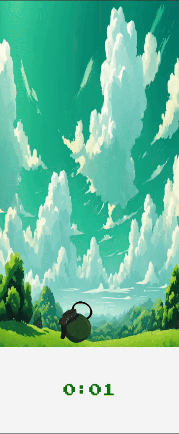
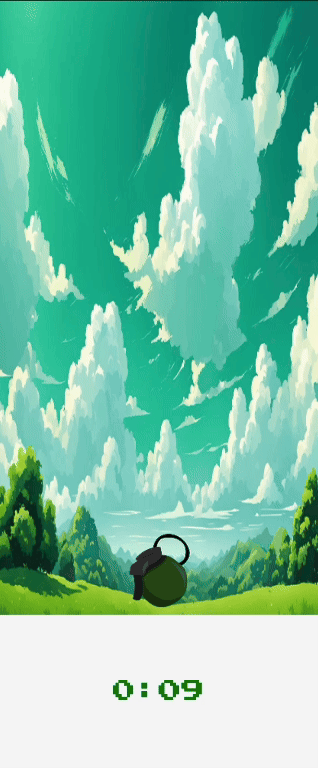
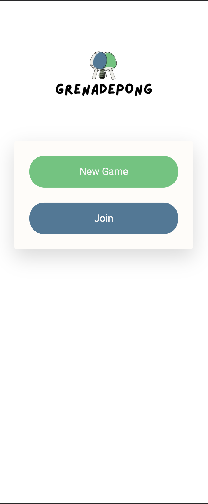
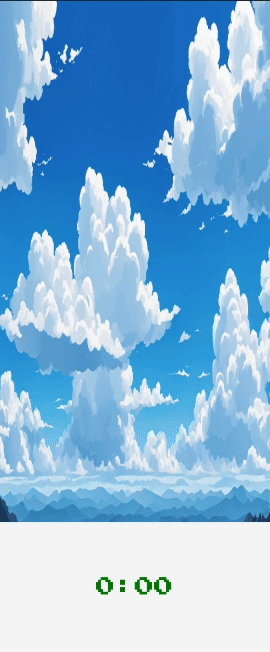
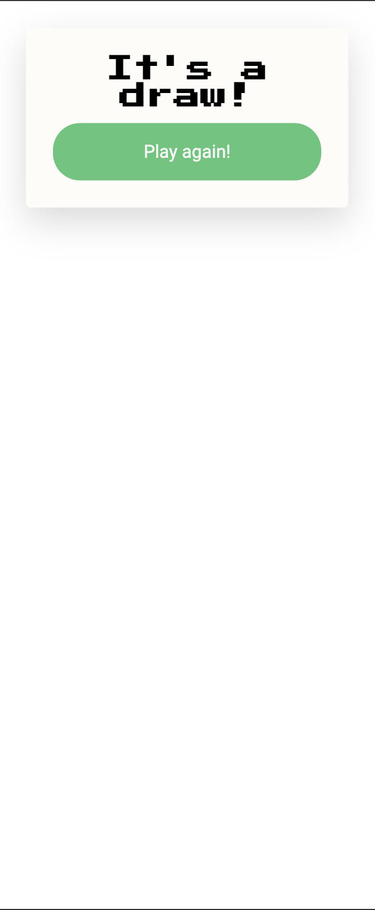

# Grenadepong 🎮💥

[DEMO](https://cholnhial.github.io/grenadepong)

## 🌟 Overview


Grenadepong is a unique twist on the classic 2D pong game where your fingers become the paddles. Play with a friend either in close proximity or across the internet. I recommend playing on mobile for the best experience - just have your friends scan the QR code or join via a shared code!

### 🚀 Motivation

I created this game primarily for fun and as a learning experience. By leveraging modern web technologies, I demonstrated how multiplayer web games can be developed with minimal backend infrastructure.

#### 🚰 Tech Stack
- Angular
- PixiJS (2D game engine)
- PeerJS (WebRTC implementation for multiplayer functionality)

During development, I discovered an exciting possibility: creating multiplayer web games that rely solely on communication without needing a traditional backend.

**Note**: Game assets (grenades, background, explosion audio) are sourced from free asset sites. I didn't create these graphics or sounds myself.

Interestingly, much of the game's physics were developed with AI assistance from Claude and ChatGPT. My primary focus was on the communication aspects and asset selection. While the game might seem barebones, it showcases how AI can dramatically accelerate development when you have a clear vision.

### 🌉 Seamless Cross-Screen Gameplay

#### 🚀 Breakthrough Multiplayer Mechanics

One of the most innovative features I've created in Grenadepong is the incredibly smooth ball transition across players' screens. By leveraging PeerJS, I've developed a multiplayer experience where the ball seems to pass through screens as if they were one continuous surface.



#### 🔮 How I Made It Work
When the ball reaches the edge of one player's screen, here's what happens:
- Precise coordinates of the ball are instantly transmitted
- I calculate the exact position, velocity, and trajectory
- The receiving screen perfectly continues the ball's movement
- There's no visual interruption or lag - it's like the screens are magically connected

#### 🌐 WebRTC Magic
This feature showcases why I chose to use WebRTC (Web Real-Time Communication):
- Direct peer-to-peer connection
- Minimal latency
- Real-time data synchronization
- No central server required

The result is a multiplayer experience so smooth, it feels like you're playing on a single, extended screen. I used PeerJS to handle the complex real-time data transmission that makes such seamless interaction possible. It was a challenging but incredibly satisfying feature to implement!
## ✨ Features

### 1. 🌐 Multiplayer Mayhem
Play with friends over the internet - distance is no obstacle!



### 2. ⏱️ Explosive Time Limit
- 30-second countdown before grenades detonate
- Win Conditions:
  - Both grenades explode on your screen? You lose!
  - No grenades explode? You win!
  - Only one grenade explodes? It's a draw!
- Winning triggers a spectacular confetti celebration (thanks to `canvas-confetti`)!



### 3. 🔁 Endless Excitement
The host can restart the game infinitely - the fun never stops!



## 🖥️ Development

Want to make the game your own? Here's how:

1. Clone the repository
2. Install dependencies:
   ```bash
   npm install
   ```

3. Start the development server:
   ```bash
   ng serve --host 0.0.0.0
   ```

4. In the console, you'll see your IP. Modify `src/environments/environment.development.ts`

5. If your mobile is on the same network, scan the QR code to join

### 🚀 Deployment
Deploy to GitHub Pages with:
```bash
ng deploy --base-href=/grenadepong/
```

**Requirements**:
- Node.js version 18 or higher

## 📋 Contributing

Contributions, issues, and feature requests are welcome! Feel free to check the [issues page](your-repo-issues-link).

## 🐜 License

MIT

## 🙌 Acknowledgments

- Special thanks to AI assistants for helping with physics implementation
- Free asset sites for game graphics and sounds
- The open-source community

---

**Happy Gaming! 🎮🔫**

